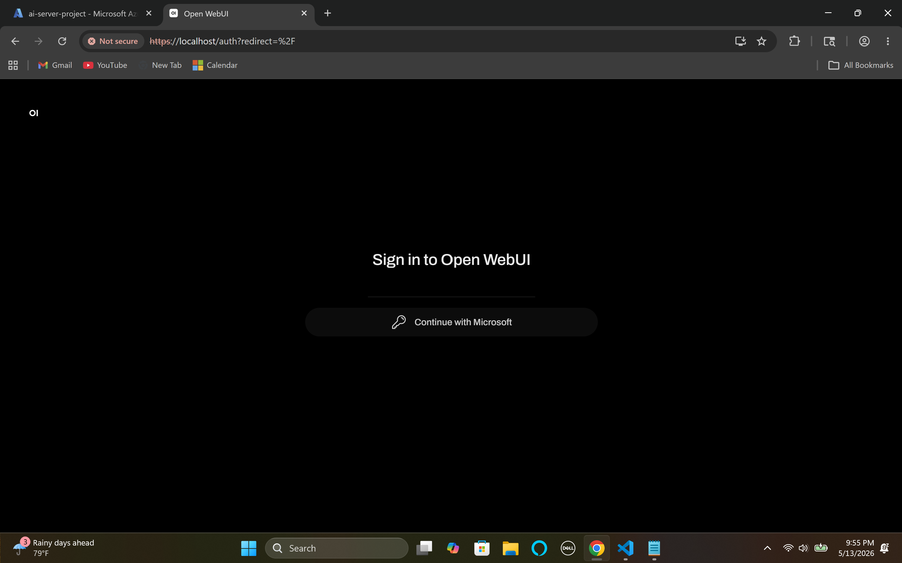
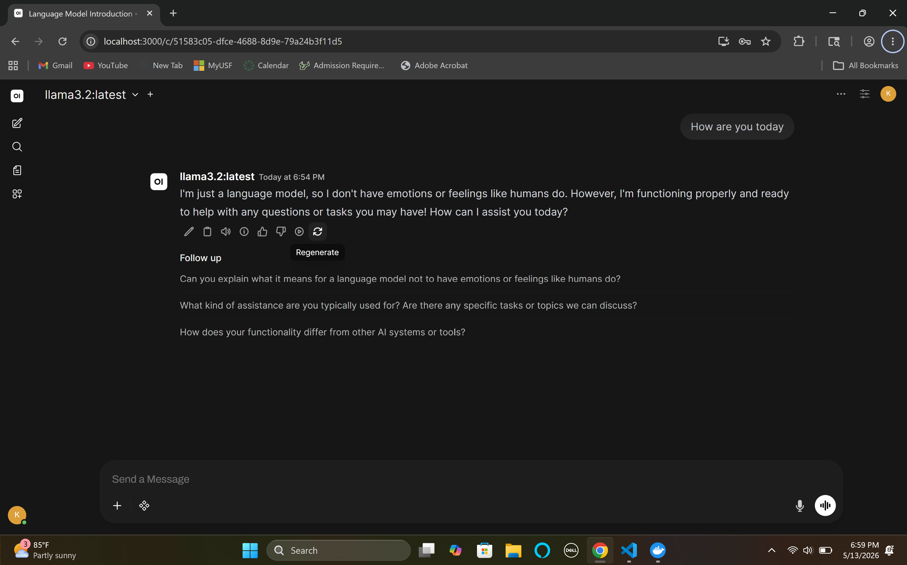
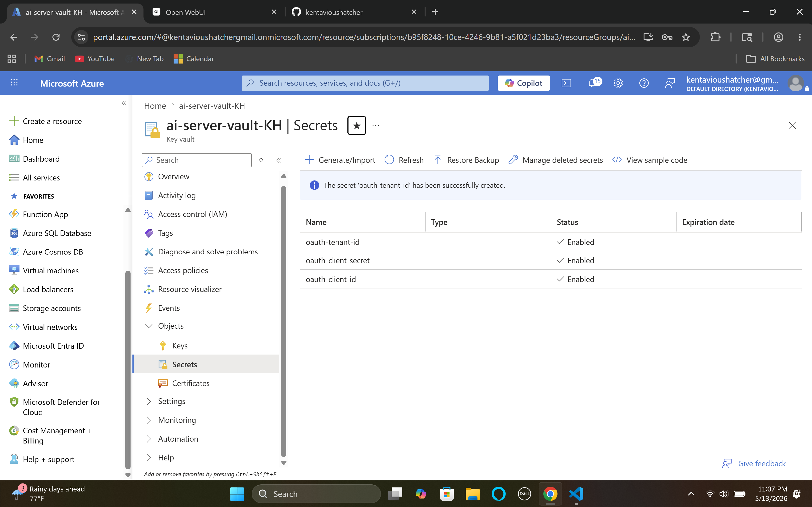
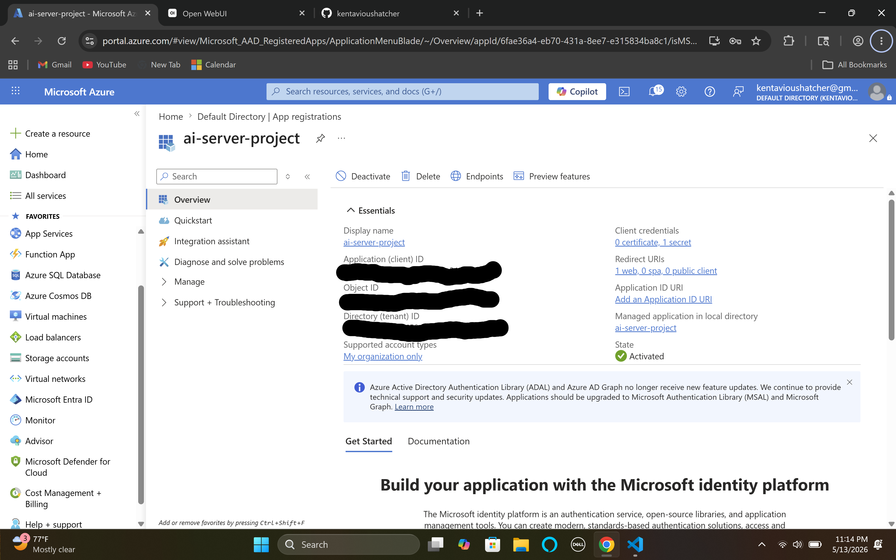

# Local AI Server with Azure Security

## Overview
A self-hosted AI chat server running Llama 3.2 locally,
secured with Azure Entra ID SSO and Azure Key Vault.

## Tech Stack
- Ollama (LLM inference engine)
- Open WebUI (chat interface)
- Docker & Docker Compose (containerization)
- Caddy (reverse proxy + TLS encryption)
- Azure Entra ID (Microsoft SSO authentication)
- Azure Key Vault (secret management)

## Architecture
- Local AI inference with no data leaving your machine
- HTTPS encryption via Caddy reverse proxy
- Microsoft SSO login via Azure Entra ID
- Secrets stored securely in Azure Key Vault

## Setup Instructions
1. Clone this repo
2. Install Docker Desktop and Ollama
3. Create Azure Entra ID app registration
4. Create Azure Key Vault and add secrets
5. Update docker-compose.yml with your Azure values
6. Run docker-compose up -d
7. Visit https://localhost

## Skills Demonstrated
- Cloud Security (Azure)
- containerization (Docker)
- Identity & Access Management (SSO/OIDC)
- Secret Management (Key Vault)
- Reverse Proxy & TLS (Caddy)
- Local AI Deployment (Ollama)

## Screenshots

### Login Page (Microsoft SSO)

### AI CHAT Interface

### Azure Key Vault

### Azure App Registration

